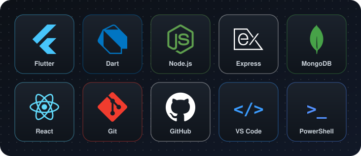

<h1 align="center">Hi, I'm Salim</h1>
<h3 align="center">Computer Science student, building for real problems</h3>

I'm a Computer Science student at Meru University of Science and Technology who likes turning ideas into working software, big or small. 
I've built projects like GitBattle, a mobile app, and a street view mapping app for the school, and I love learning new technologies as part of a team.

### Core skills

- **Mobile Development (Flutter/Dart):** JSON serialization, async programming, data visualization, animation
- **Backend Development (Node.js):** third-party API integration, background processing, error handling
- **Systems & Architecture**
- **DevOps & Tooling**
- **Product & Design Thinking**

### What I'm building

- **[AgriShield](https://github.com/Trojanicon/agrishield)**: Parametric crop insurance for
  Kenyan smallholder farmers, delivered over USSD/SMS. Node.js/Express/MongoDB backend,
  Africa's Talking for USSD, Open-Meteo weather data, and a React dashboard with SVG rain-gauge
  visualizations. Includes a drought rule engine that triggers payouts after a 30-day dry spell.
- **[GitBattle](https://github.com/Trojanicon/gitbattle)**: A gamified GitHub activity tracker
  for university students. Node.js/Express/MongoDB backend with a Flutter frontend.
- **[Swalah](https://github.com/Trojanicon/swalah)**: A Flutter/Android Islamic prayer times
  and Adhan reminder app, with offline astronomical prayer-time calculation, an Aladhan API
  fallback, and native AlarmManager integration for reliable alerts.

### Tools & tech

  

### GitHub Stats

  
  

### Connect

<i>Thanks for stopping by, feel free to explore my repoz above.</i>

